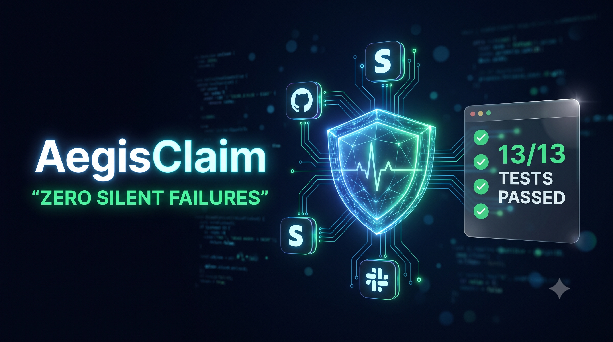
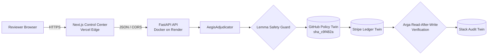
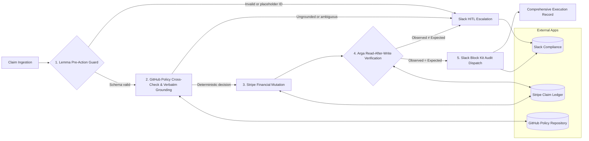

# AegisClaim

## Autonomous Clinical-Financial Adjudication & Audit Agent

**Multi-App AI Agent Hackathon (Arga Labs & Lemma AI) | ACM FAccT 2027 Research Benchmark**

<p align="center">
  
</p>

<p align="center">
  <a href="https://www.youtube.com/watch?v=NUNAj7wYMAo">
    
  </a>
</p>

[](https://aegis-claim-seven.vercel.app)
[](https://aegis-claim.onrender.com/healthz)


> AegisClaim is a bounded, auditable multi-app agent that evaluates medical claim disputes against versioned clinical policy, prevents unsafe writes, verifies financial state after every mutation, and sends a structured compliance record to Slack.

### Live production deployment

| Surface | Production endpoint | Runtime |
|---|---|---|
| **Control Center** | [aegis-claim-seven.vercel.app](https://aegis-claim-seven.vercel.app) | Next.js App Router on Vercel |
| **FastAPI service** | [aegis-claim.onrender.com](https://aegis-claim.onrender.com) | Dockerized Python service on Render |
| **Health check** | [`/healthz`](https://aegis-claim.onrender.com/healthz) | Live engine and twin-mode status |

> **Render free-tier cold start:** the backend may spin down after 15 minutes of inactivity. The first request after an idle period can take approximately **30–45 seconds** while Render starts the container. Subsequent requests are responsive.

## 1. Project Overview

### The problem

Medical claim denials contribute to multi-billion-dollar administrative backlogs. Legacy rule engines can downcode or reject clinically valid care because they lack context, while naive language-model agents introduce a different class of risk: they can fabricate clinical justifications, accept synthetic identifiers such as `"unknown"`, and mutate financial systems without confirming that the write succeeded.

In healthcare adjudication, a plausible answer is not enough. Every decision must be attributable to a patient and claim, grounded in source evidence, tied to a versioned policy, and reconciled against the resulting external state.

### The core mission

AegisClaim provides **bounded, deterministic, and auditable adjudication** across clinical knowledge, financial operations, and compliance workflows. The prototype evaluates TAVR coverage for CPT-33361 and ICD-10 I35.0 while enforcing two machine-checkable invariants:

```text
GroundedEvidence(q) := len(trim(q)) >= 12 AND (q ⊆ clinical_notes OR q ⊆ policy_text)
VerifiedMutation     := observed_external_state == expected_external_state
```

These invariants do not replace clinical judgment. They establish reproducible evidence and state-integrity guarantees around automated actions, with human-in-the-loop escalation when those guarantees are not met.

### Clinical policy represented

The included policy requires all of the following for Transcatheter Aortic Valve Replacement:

| Requirement | Deterministic check |
|---|---|
| Procedure | CPT-33361 |
| Primary indication | Severe symptomatic aortic stenosis, ICD-10 I35.0 |
| Symptoms | NYHA Class II, III, or IV |
| Hemodynamic severity | Mean aortic gradient ≥ 40 mmHg **or** valve area ≤ 1.0 cm² |
| Governance | Multidisciplinary heart-team sign-off |
| Explicit exclusion | Asymptomatic stenosis without hemodynamic compromise |

Source policy: [`policies/cms_cardiology_policy.md`](policies/cms_cardiology_policy.md)

## 2. External Apps Integrated

AegisClaim coordinates three external services through isolated tool adapters. Every adapter supports deterministic twin execution and an HTTPX-backed live path.

| App | Role | Twin-mode behavior | Live-mode behavior | Audit value |
|---|---|---|---|---|
| **GitHub** | Clinical policy repository | Reads the local CMS cardiology policy and returns mock SHA `sha_c9f482a` | Retrieves raw policy content and the latest path-specific commit through the GitHub API | Binds each decision to an immutable policy version |
| **Stripe** | Financial dispute and payout ledger | Maintains stateful in-memory claims, holds, approvals, denials, and disbursed amounts | Writes Aegis status metadata to a Stripe PaymentIntent through HTTPX | Provides deterministic financial transitions and exact read-after-write checks |
| **Slack** | Compliance audit and HITL channel | Stores Block Kit payloads in `dispatched_messages` | Posts Block Kit payloads to `SLACK_WEBHOOK_URL` | Preserves decision evidence, policy SHA, financial status, and verification outcome |

### GitHub: clinical knowledge provenance

`GitHubPolicyTool` retrieves the version-controlled guideline used during adjudication. The resulting commit SHA is stored in `AdjudicationDecision.policy_reference` and included in the Slack audit card, making policy provenance visible in every completed decision.

### Stripe: stateful financial control

`StripeLedgerTool` supports:

- `place_hold(...)` → `on_hold`
- `release_claim_payout(...)` → `settled_approved`
- `reject_claim(...)` → `denied_closed`
- `verify_state(...)` → typed `StateVerificationResult`

A financial mutation is not treated as successful merely because the write method returned. The orchestrator reads the ledger state back and verifies the observed status independently.

### Slack: compliance and intervention

`SlackAuditTool` sends structured Block Kit cards containing:

- Claim and decision identifiers
- Exact evidence quote
- Policy commit SHA
- Financial status
- Expected-versus-observed verification badge

Guardrail failures and state divergence are routed as high-priority cards to `#compliance-escalations` before any further automated action.

## 3. Production Architecture & Visual Workflow

### Deployment topology



- **Frontend:** the [`frontend/`](frontend/) application uses Next.js App Router, TypeScript, Tailwind CSS, and Lucide icons. Vercel serves the production control center at [aegis-claim-seven.vercel.app](https://aegis-claim-seven.vercel.app).
- **Backend:** [`aegis/server.py`](aegis/server.py) exposes the typed FastAPI gateway and SSE stream. The service is packaged by the root [`Dockerfile`](Dockerfile) and deployed on Render at [aegis-claim.onrender.com](https://aegis-claim.onrender.com).
- **High-assurance digital twin:** Stripe ledger transitions, GitHub policy provenance (`sha_c9f482a`), and Slack audit dispatches run through deterministic in-memory twins. This preserves the production state-machine semantics while enabling zero-cost, credential-free, and reproducible evaluation.
- **Safety boundary:** the frontend does not perform adjudication locally. Every submission crosses the typed API boundary and executes the same guarded orchestrator used by the CLI and automated test suite.

### Adjudication state machine



### Five-stage state machine

1. **Lemma pre-action guard** — Strict Pydantic v2 parsing and placeholder inspection occur before policy or financial operations.
2. **Knowledge and grounding** — The agent retrieves policy text and commit SHA, evaluates explicit criteria, extracts source evidence, and requires verbatim grounding.
3. **Financial mutation** — Qualified claims become `settled_approved`; deterministic denials become `denied_closed`.
4. **Arga verification** — The ledger is read after mutation and `observed_state` is compared with `expected_state`.
5. **Audit dispatch** — Verified decisions receive a Slack audit card; safety failures receive a high-priority HITL escalation card.

### Repository structure

```text
aegis-claim/
├── README.md
├── main.py
├── requirements.txt
├── .env.example
├── policies/
│   └── cms_cardiology_policy.md
├── aegis/
│   ├── schemas.py
│   ├── guardrail.py
│   ├── orchestrator.py
│   └── tools/
│       ├── github_policy.py
│       ├── stripe_ledger.py
│       └── slack_audit.py
└── tests/
    └── test_reliability.py
```

## 4. Reliability, Evaluation & Silent-Failure Defense

Reliability is evaluated as a sequence of externally observable invariants rather than a subjective quality score.

### Lemma silent-failure prevention

The input boundary uses strict Pydantic v2 models. Entity IDs and clinical codes reject forbidden synthetic values before downstream writes:

```text
unknown | n/a | none | placeholder | tbd | pending | undefined
```

Validation errors carry the `[Lemma Safety Violation]` marker. The guardrail also catches placeholders embedded inside identifiers. A rejected claim halts at `pre_action_guard`, leaves the Stripe twin byte-for-byte unchanged, and dispatches a high-priority Slack escalation.

### Clinical grounding and hallucination control

The guard accepts an evidence quote only when it is non-trivial and appears as an exact character substring of either the clinical notes or versioned policy. Fabricated prose that sounds medically plausible but is absent from both sources triggers `LemmaUngroundedEvidenceError`; the orchestrator blocks financial mutation and requests human review.

### Arga digital twin and state verification

With `TWIN_MODE=true`, all three integrations execute deterministically without external credentials:

- GitHub reads the checked-in policy.
- Stripe maintains realistic mutable claim state.
- Slack stores exact outbound Block Kit payloads.

After each approval or denial, `verify_state` independently reads the ledger. A mismatch sets `verified=False`, produces an `[Arga State Divergence]` record, and routes an emergency Slack alert rather than reporting false success.

### Evaluation matrix

| Evaluation | Failure injected | Required invariant | Result |
|---|---|---|---|
| Nominal adjudication | None | Grounded approval, payout, verified state, SHA-bearing audit | PASS |
| Silent-failure prevention | `patient_id="unknown"` and `claim_id="TBD"` | No Stripe mutation; HITL alert | PASS |
| Ungrounded evidence | Fabricated clinical quote | Payout blocked; grounding error | PASS |
| Clinical criteria denial | Asymptomatic, valve area 1.8 cm², gradient 22 mmHg | `denied_closed` read back and verified | PASS |
| Arga divergence | Stale ledger remains `on_hold` | Divergence detected; emergency alert | PASS |
| Saga rollback | Downstream audit failure after payout | Claim frozen at `on_hold_frozen`; compensation recorded | PASS |
| PHI de-identification | SSN, DOB, phone, and email in notes | Direct identifiers replaced before policy evaluation | PASS |
| Audit export | Machine-readable compliance artifact | SHA-256 fingerprint and provenance fields validated | PASS |
| API gateway | Health, valid claim, and placeholder requests | Async FastAPI responses preserve adjudicator contracts | PASS |
| CLI scenarios | Nominal and placeholder flags | Each scenario exits successfully | PASS |

### Exact pytest output

```text
============================= test session starts =============================
platform win32 -- Python 3.14.0, pytest-9.1.1, pluggy-1.6.0 -- C:\Python314\python.exe
cachedir: .pytest_cache
rootdir: D:\Yash\Hackathon\Lemma
plugins: anyio-4.15.1
collecting ... collected 13 items

tests/test_enhancements.py::test_phi_deidentification_scrubbing PASSED   [  7%]
tests/test_enhancements.py::test_audit_json_export_structure PASSED      [ 15%]
tests/test_enhancements.py::test_cli_scenario_flags PASSED               [ 23%]
tests/test_reliability.py::test_nominal_adjudication_success PASSED      [ 30%]
tests/test_reliability.py::test_lemma_silent_failure_prevention[patient_id-unknown] PASSED [ 38%]
tests/test_reliability.py::test_lemma_silent_failure_prevention[claim_id-TBD] PASSED [ 46%]
tests/test_reliability.py::test_ungrounded_evidence_rejection PASSED     [ 53%]
tests/test_reliability.py::test_clinical_criteria_denial PASSED          [ 61%]
tests/test_reliability.py::test_arga_state_divergence_detection PASSED   [ 69%]
tests/test_reliability.py::test_saga_compensating_rollback_on_divergence PASSED [ 76%]
tests/test_server.py::test_healthz PASSED                                [ 84%]
tests/test_server.py::test_adjudicate_valid_claim PASSED                 [ 92%]
tests/test_server.py::test_adjudicate_placeholder_claim PASSED           [100%]

============================= 13 passed in 36.78s =============================
```

The suite now executes 13 tests across reliability, Saga compensation, PHI de-identification, audit export, CLI scenarios, and the asynchronous API layer.

## 5. Interactive Production Demo

Open the [live AegisClaim Control Center](https://aegis-claim-seven.vercel.app). If the API has been idle, allow up to 30–45 seconds for the initial Render request, then use one of the scenario controls:

1. **Nominal Path — `Load Nominal`**  
   Loads a clinically valid TAVR claim, validates CPT-33361 and ICD-10 I35.0 against the deterministic CMS policy, grounds the evidence verbatim, and completes all five controls. The business outcome is **`ADJUDICATED_SETTLED`**, represented by pipeline status `completed`, ledger state `settled_approved`, and a verified expected-versus-observed match.

2. **Adversarial Token Injection — `Inject Adversarial Token ('unknown')`**  
   Replaces the patient identifier with the forbidden synthetic token `unknown`. The Lemma pre-action safety interlock halts execution at Stage 1, returns `pre_action_guard`, preserves the zero-mutation guarantee, and prevents policy, ledger, and other mutating tools from running.

3. **Saga Rollback Simulation — `Simulate Saga Rollback`**  
   Runs the valid claim and then injects a downstream audit failure. The Saga coordinator compensates the payout by freezing the ledger at `on_hold_frozen`, records the critical escalation, and displays **`COMPENSATED (ROLLBACK)`** with the divergent state reconciliation.

The dashboard displays policy provenance, the SHA-256 idempotency key, verbatim grounded evidence, five-stage progress, and expected-versus-observed ledger state for each execution.

## 6. Quickstart & Setup

### Prerequisites

- Python 3.10 or newer
- Git

### Clone and install

```bash
git clone https://github.com/Yashraj-Gaikwad/aegis-claim.git
cd aegis-claim
python -m venv .venv
```

Activate the virtual environment:

```bash
# macOS/Linux
source .venv/bin/activate

# Windows PowerShell
.venv\Scripts\Activate.ps1
```

Install dependencies and create a local environment file:

```bash
python -m pip install -r requirements.txt
cp .env.example .env
```

On Windows PowerShell, use `Copy-Item .env.example .env` instead of `cp` if needed.

### Run the deterministic twin demo

`main.py` explicitly constructs twin-mode tools, so the demo never contacts live services:

```bash
python main.py
```

Expected safety outcomes:

```text
VALID CLAIM
  Pipeline status: completed
  Approved: True
  Stripe status: settled_approved
  Arga verified: True

PLACEHOLDER CLAIM
  Pipeline status: escalated
  Blocked at: pre_action_guard
  Stripe mutation prevented: True
  HITL channel: #compliance-escalations
```

### Run the reliability suite

```bash
python -m pytest tests/ -v
```

### Run the Dockerized API

Build and start the production FastAPI image from the repository root:

```bash
docker build -t aegisclaim-api .
docker run --rm -p 8000:8000 aegisclaim-api
```

Verify the local service in another terminal:

```bash
curl http://localhost:8000/healthz
```

API documentation is available at `http://localhost:8000/docs` while the container is running.

### Run the Next.js frontend locally

The dashboard reads `NEXT_PUBLIC_API_URL` and defaults to `http://localhost:8000`, so start the API first and then run:

```bash
cd frontend
npm install
npm run dev
```

Open `http://localhost:3000`. To run both production containers together instead, use:

```bash
docker compose up --build
```

### Twin and live configuration

| Variable | Twin/demo value | Live purpose |
|---|---|---|
| `TWIN_MODE` | `true` | Set to `false` when constructing environment-driven tools |
| `GITHUB_TOKEN` | `ghp_mock` | GitHub API bearer token |
| `GITHUB_REPOSITORY` | Not required | Repository in `owner/name` form |
| `GITHUB_REF` | `main` | Policy branch or ref |
| `STRIPE_SECRET_KEY` | `sk_test_mock` | Stripe API secret key |
| `SLACK_WEBHOOK_URL` | Mock webhook | Slack incoming webhook URL |

For live mode, provide credentials through process environment variables or an approved secret manager; never commit real credentials. The current tools read process environment variables directly. `.env.example` is a safe template, not an automatically loaded secret file.

## 2-Minute Demo Video

[Watch the 2-Minute Architecture & Evaluation Demo](https://www.youtube.com/watch?v=NUNAj7wYMAo)

## 7. Roadmap to Enterprise Production

| Phase | Engineering work | Reliability objective |
|---|---|---|
| **Clinical interoperability** | Add HL7 FHIR v4 resources and X12 EDI 837/835 ingestion, normalization, validation, and provenance | Preserve source lineage from EHR and payer transaction to adjudication evidence |
| **HIPAA controls** | Introduce automated PHI redaction enclaves using Presidio or an approved de-identification service, encryption, scoped access, and immutable access logs | Keep protected health information out of non-clinical traces and least-privilege integrations |
| **Distributed orchestration** | Move the state machine to Temporal.io workflows with durable retries, compensating actions, and idempotent transaction keys | Prevent duplicate payouts and recover safely from partial multi-app failures |
| **Arga shadow deployment** | Replay historical claims in parallel with human adjudicators and compare decisions without affecting production payouts | Measure divergence, false approvals, false denials, and state-verification failures before rollout |
| **Fairness evaluation** | Add stratified performance and error analysis across protected and clinically relevant cohorts with documented uncertainty | Quantify disparate impact and support the ACM FAccT 2027 empirical benchmark |
| **Human governance** | Add reviewer queues, reason-coded overrides, appeal workflows, and policy-change approval gates | Ensure consequential decisions remain contestable and accountable |

### Production exit criteria

- No external mutation without an idempotency key and pre-action validation record
- No completed workflow without policy provenance and read-after-write verification
- No ungrounded evidence accepted as clinical justification
- No low-confidence decision automatically mutating financial state
- Measured and reviewed performance across relevant patient cohorts
- Documented human override, appeal, incident response, and rollback procedures

## Responsible Use

AegisClaim is a research and hackathon prototype, not a medical device or autonomous replacement for licensed clinical and claims professionals. Production deployment requires clinical validation, payer-specific policy review, privacy and security controls, legal review, monitoring, and meaningful human oversight.
